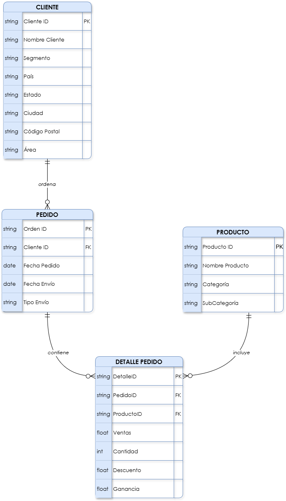

## Esquema Relacional - Tienda en línea

**Cliente** (<u>ClienteID (PK)</u>, NombreCliente, Segmento, País, Estado, Ciudad).  
**Producto** (<u>ProductoID (PK)</U>, NombreProducto, Categoría, Subcategoría).  
**Pedido** (<u>PedidoID (PK)</u>, FechaPedido, FechaEnvio, TipoEnvio, ClienteID (FK)).  
**Detalle Pedido** (<u>DetalleID (PK)</u>, PedidoID (FK), ProductoID (FK), Ventas, Cantidad, Descuento, Ganancia).  

**Cliente_Pedido** (<u>Cliente ID</u>, Segmento, País, Ciudad, Estado, Región).  
**Pedido_Detalle Pedido** (<u>PedidoID</u>, <u>ProductoID</u>).

### _Relaciones clave:_

 - **Uno a muchos:** Cliente - Pedido, Pedido - Detelle Pedido, Producto - Detalle Pedido.
 - **Muchos a muchos:** Pedido - Producto. 

 ## Diagrama Relacional
 
 

## Operaciones a utilizar en la base de datos: Tienda en línea

1. **Selección (σ): Filtrar pedidos con beneficio positivo.**  
**_Operación:_** σ(Ganancia > 0)(Pedidos)  
Esta operación selecciona todas las filas de la relación (Pedidos) donde el valor de la columna (Ganancia) es mayor que cero.  
Obtener un subconjunto de pedidos que generaron ganancias, excluyendo aquellos que resultaron en pérdidas.

2. **Proyección + Selección: Listar los nombres de los clientes que hicieron pedidos en el estado de "California"**  
**_Operación:_** π(Nombre Cliente)(σ(Estado = 'California')(Pedidos))  
Esta consulta realiza dos pasos:  
    - Selección (σ(Estado = 'California')) - Filtra los pedidos que se realizaron en el estado de California.  
    - Proyección (π(Nombre Cliente)) - Extrae solo los nombres de los clientes de esos pedidos, eliminando duplicados.

    Una lista única de clientes que compraron productos en California.

3. **Intersección (∩): Encontrar clientes que compraron tanto en 2016 como en 2017**  
**_Operación:_**  
π(Cliente ID)(σ(AÑO(Fecha Pedido) = 2016)(Pedidos)) ∩ π(Cliente ID)(σ(AÑO(Fecha Pedido) = 2017)(Pedidos))  
    - Asumiendo que filtramos por año usando la columna (Fecha Pedido), extraemos los Cliente ID de pedidos realizados en 2016, hacemos lo mismo con los de 2017.

    La intersección (∩) nos da los clientes que aparecen en ambos años, es decir, clientes recurrentes.

4. **Join, selección y proyección: Obtener nombres de productos tecnológicos vendidos**  
**_Operación:_** π(Nombre Producto)(σ(Categoría = 'Technology')(Pedidos ⨝ Productos))  
    - Join (Pedidos ⨝ Productos) - Unimos las tablas para acceder tanto a los datos del pedido como del producto.  
    - Selección (σ(Categoría = 'Technology')) - Filtramos los registros combinados para quedarnos solo con aquellos donde el producto pertenece a la categoría 'Technology'.
    - Proyección (π(Nombre Producto)) - Extraemos únicamente los nombres de los productos tecnológicos vendidos, eliminando duplicados.
    
    Lista de productos de tecnología que han sido vendidos.